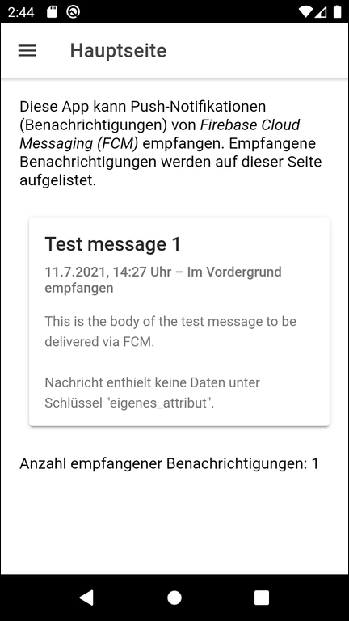
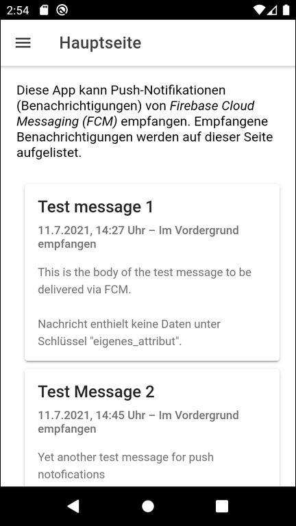
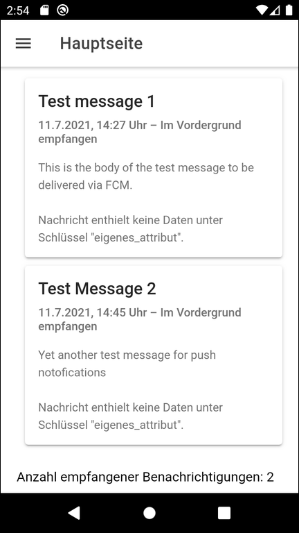
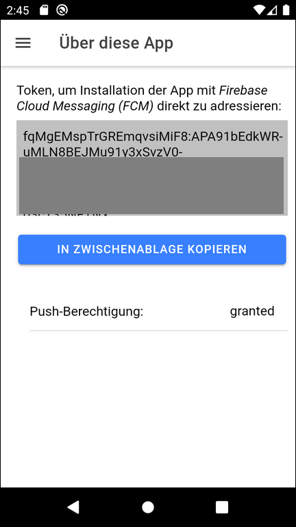

# Ionic app to receive push notifications #

This repository contains a simple [Ionic](https://ionicframework.com/) app using [Capacitor](https://capacitorjs.com/) and [Angular](https://angular.io/), that demonstrates how push notifications from [Firebase Cloud Messaging (FCM)](https://firebase.google.com/docs/cloud-messaging/) can be received.

 

----

## Screenshots ##

  

  

 

----

## Download of configuration file for Android ##

In the [Firebase Console](https://console.firebase.google.com), you have to go to the corresponding project
and open the project settings:
* If not already existing, you have to create an Android app on tab "General".
* Download file `google-services.json` on the card for this app.
* Replace [this file](android/app/google-services.json) in folder `android/app/` with the file downloaded from the *Firebase Console*.

 

See also section "Get config file for your Android app" in [this article](https://support.google.com/firebase/answer/7015592?hl=en#zippy=%2Cin-this-article) on *support.google.com*.

 

----

## License ##

See the [LICENSE file](LICENSE.md) for license rights and limitations (BSD 3-Clause License) for the files in this repository.

 
